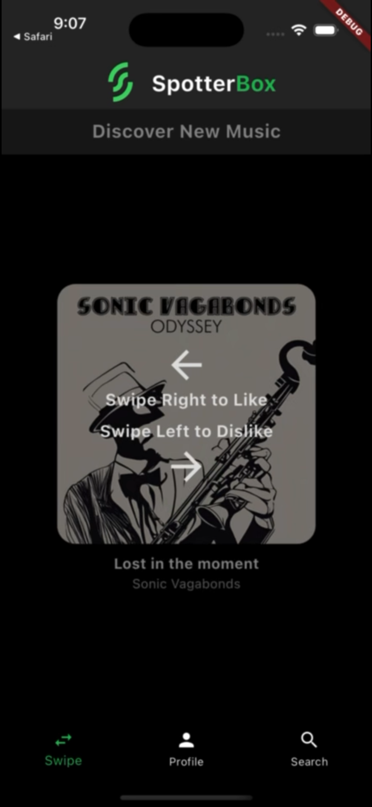
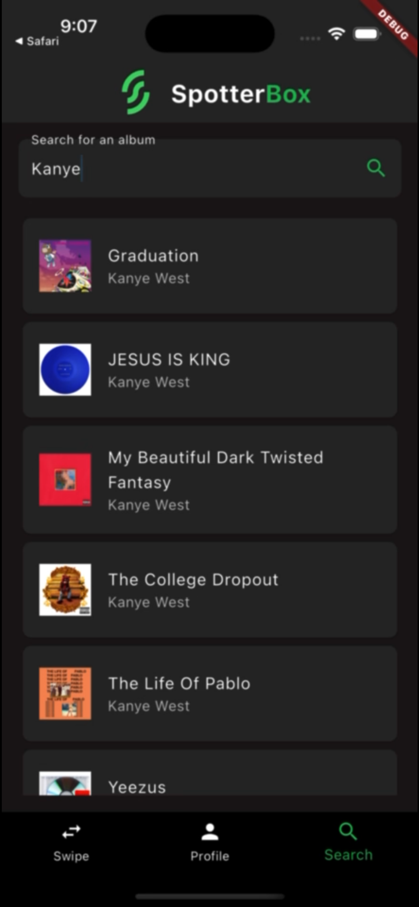
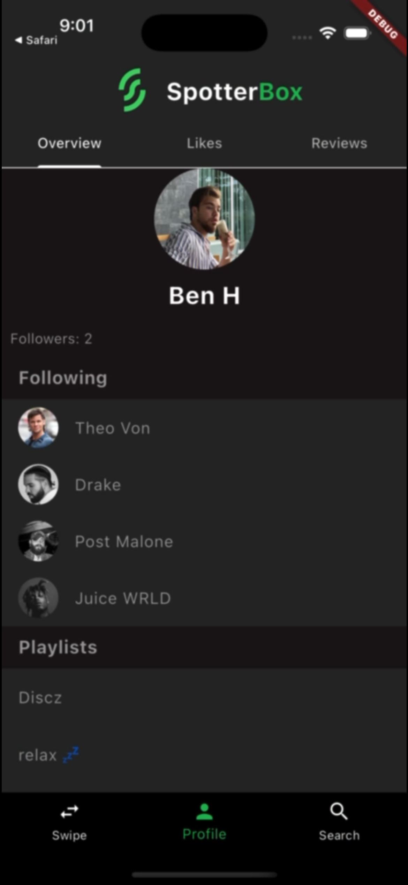

# SpotterBox
SpotterBox is an IOS app, hosting a social platform for the Curation, Discovery and Rating of music.
* Leveraged RAG to fetch tailored recommendations based on user Spotify data and activity in the swipe tab
* Utilized a secure cloud-based backend to ensure accuracy, stability and retention of all user characteristics & activities
* Implemented the Spotify API to link users' Spotify accounts directly into the app, and fetch song & album data
* Used Flutter to develop a beautiful front end 

